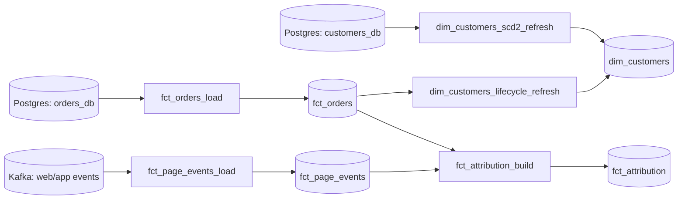

# Pipelines

Catalog of scheduled jobs that produce the tables in `docs/schema/` and `docs/external-tables/`. Source of truth for **schedules, dependencies, SLAs, and what to do when something breaks.**

> Forking? Replace the example jobs below with your real ones. Keep the columns (Schedule, SLA, Owner, Failure runbook) — those are the load-bearing pieces.

## Conventions

- All times are **UTC** unless noted.
- All schedules use **cron syntax** (5-field: `min hour dom mon dow`).
- **SLA** = the hour by which the table is expected to be available for downstream consumers. Missed SLA → page the on-call.
- **Watermark** = the maximum lag between event-time and write-time. Late-arriving rows beyond the watermark are dropped to a `_late` table; they don't backfill the original partition.

## Job catalog

### `fct_orders_load`

- **Produces:** `analytics_prod.core.fct_orders`
- **Schedule:** `30 1 * * *` (daily 01:30 UTC)
- **Inputs:** Postgres replica `orders_db.public.orders`, `orders_db.public.order_items`
- **Mode:** Daily incremental on `order_date` (insert + update on `status` changes)
- **SLA:** 03:00 UTC
- **Watermark:** 24h (orders with `created_at` > 24h after event time go to `_late`)
- **Owner:** Data Eng — Commerce (`#data-eng-commerce` Slack)
- **Common failures:**
  - Source replica lag > 1h: rerun once replica catches up. Transient.
  - Schema drift on `orders_db.public.orders`: pause the job, ping Commerce-Eng (they own the source schema), update `docs/schema/fct_orders.md`.

### `fct_page_events_load`

- **Produces:** `analytics_prod.core.fct_page_events`
- **Schedule:** `0 */1 * * *` (hourly)
- **Inputs:** Kafka topic `abcbusiness.web.events`, `abcbusiness.app.events`
- **Mode:** Hourly append-only by `event_date`
- **SLA:** end-of-hour + 90 min (e.g., 10:00–11:00 partition available by 12:30)
- **Watermark:** 6h
- **Owner:** Data Eng — Clickstream (`#data-eng-clickstream`)
- **Common failures:**
  - Schema-registry mismatch on Kafka: blocks the run. Update event schema, ping Clickstream-Eng.
  - Bot traffic spike → row-count anomaly alert (>3σ). Verify, then either suppress alert or investigate the spike (could be a real attack).

### `dim_customers_scd2_refresh`

- **Produces:** `analytics_prod.core.dim_customers` (SCD Type 2)
- **Schedule:** `0 2 * * *` (daily 02:00 UTC)
- **Inputs:** Postgres replica `customers_db.public.customers`, `dim_customers` (self, for diffing)
- **Mode:** SCD Type 2 merge — closes prior version (`valid_to = today`, `is_current = false`) and opens new version when any tracked attribute changes.
- **SLA:** 03:30 UTC
- **Owner:** Data Eng — Customer (`#data-eng-customer`)
- **Common failures:**
  - Tracked-attribute list drifts from source schema: surfaces as a column missing in the merge. Update job + `docs/schema/dim_customers.md`.

### `dim_customers_lifecycle_refresh`

- **Produces:** `dim_customers.lifecycle_stage` (column-level update)
- **Schedule:** `0 4 * * *` (daily 04:00 UTC)
- **Inputs:** `fct_orders`, `dim_customers`
- **Mode:** Recompute lifecycle for all currently-active customers (~50M).
- **SLA:** 05:30 UTC
- **Owner:** Data Eng — Customer
- **Note:** This job depends on `fct_orders_load` completing first. If `fct_orders_load` is late, this is automatically delayed by the orchestrator.

### `fct_attribution_build` (multi-touch attribution)

- **Produces:** `analytics_prod.core.fct_attribution`
- **Schedule:** `0 5 * * *` (daily 05:00 UTC)
- **Inputs:** `fct_page_events` (last 30 days), `fct_orders` (last 90 days)
- **Mode:** Daily full-rebuild of trailing 90-day window. Idempotent.
- **SLA:** 07:00 UTC
- **Owner:** Marketing Analytics (external — see `docs/external-tables/`)
- **Note:** This is an **external-team-owned** table. Bug reports go through the Marketing Analytics intake form, not directly to Data Eng.

## Dependency graph

## Backfills

Always plan a backfill before executing it. Use `skills/backfill-planner/SKILL.md`.

Hard rules:

- **Never** rerun `fct_page_events_load` for a partition older than the watermark (6h) without explicit owner approval — late-arriving rows have already been routed to `_late`.
- **Always** snapshot `dim_customers` before rerunning `dim_customers_scd2_refresh` retroactively (it rewrites `valid_from`/`valid_to`).
- Backfills > 30 days require a notification in `#data-eng-announce` before starting.

## Failure runbook (general)

When a job fails:

1. Run `skills/pipeline-debugger/SKILL.md`.
2. Pull the run status, error trace, and affected partition.
3. Check git for recent changes to the job (`git log --since='3 days ago' <job-path>`).
4. **Classify:**
   - Transient (replica lag, network, source not ready) → retry, do not page.
   - Code bug → page the owner, do not retry.
   - Data quality (row count anomaly, schema drift) → page the owner *and* notify the consumer team.
5. Update this doc if the failure mode is new.
